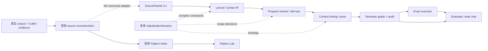

# MATHesis repository architecture — Milestone 1

2026-09-17。唯一生产仓库：本 Git repository。M1 回退基点：`6aefd18d9189b2a8c5451d3189a259dc26218692`。本文区分已经存在的实现和后续设计；后续目录不代表已交付功能。

## 当前架构

| 层 | 当前入口 / 文件 | 职责与边界 |
|---|---|---|
| Source ingestion | `config/calendrical-ir-pipeline.json`；根目录 `calendars-三统历.md`、`calendars-四分历.md`、`calendars-九执历.md`；`scripts/extract-cullen-pages.mjs`、`build-cullen-chunks.mjs` | corpus 与 Cullen PDF 的来源、页与 Proc 索引。canonical 文本不由 parser 或 UI 改写。 |
| Source reconstruction | `scripts/audit-cullen-led-source-reconstruction.mjs`；`tmp/procedure-ir/source_spans.json`、`cullen-led-source-reconstruction.json` | Cullen Proc → quote/translation/commentary → source span → audit。输出的 primary/context span ID 是适配依据；节选不是全文。`tmp` 是可再生审计输出，不是生产源码。 |
| Parser / lexical | `analysis_parser/inputs.py`、`lexical.py`、`construction_ir.py`；入口 `pipeline.parse_packet` | `inputs.documents` 读取 SourcePacket；词法候选进入构式解析。`schema_version` 以 `3.` 开头时走 `ScopedParser`，其余维持既有兼容入口。 |
| Syntax IR | `analysis_parser/syntax_ir.py`；`construction_ir.parse_syntax` | 有来源的构式、候选与缺口。与最终 semantic graph 分层。 |
| Program IR | `analysis_parser/program_ir.py`、`context_compiler.py` | `compile_frames`、`static_interface` 形成定义、作用域、def/use、参数/返回端口；`compile_documents` 组织上下文。 |
| Context linking | `program_ir.link_entry`、`context_compiler.py` | 跨定义 producer、调用、端口和 query 基态解析。不能用同名字符串或最终数值代替实体链接。 |
| Semantic graph | `analysis_parser/scoped.py`、`state.py`、`operations.py`、`audit.py` | `lower_linked` 和 Environment 生成 event/value、source、reads/writes、scope、method 等图及检查。图是编译产物。 |
| Executor | `analysis_parser/execution.py` | `execute(report, inputs, …)`，精确数值、调用及执行轨迹；不读取 gold/reference。 |
| Evaluator | `evaluation/handoff-v2/`、`evaluation/handoff-v3/`、`evaluation/rescue-v3_1/` | 固定语义义务、数值、链闭合、变异测试、运行隔离。只被测试/审计调用，禁止成为生产依赖。 |
| Website UI | `.eleventy.js`、`src/*.md`、`src/js/`、`src/css/`、`static/`；现有 `server/` 为 CText 服务 | Eleventy 网站。目前没有 adjudication Python API；M1 不引入 UI 或服务器。 |
| Pattern Lab comparison | `src/patterns.md`、`src/js/patterns.js`、`scripts/build-cullen-pattern-index.mjs`、`static/procedure-ir/cullen-ch3-algorithm-comparison.json` | pattern/chunk 浏览、pairwise alignment、reference comparison 与旧 six-axis scoring。页面内交互状态与离线索引构建均保持原样。 |

## 重复、平行与历史路径处置

| 路径 | 本轮处置 | 理由 |
|---|---|---|
| `analysis_parser/` | 唯一 Python production implementation；16 文件从 v3.1 原字节导入 | 不重写已验证 parser/IR/executor。M1 只确立边界；大型模块未来仅在具体窄接口需要时改动。 |
| `scripts/build-procedure-ir.mjs`、`scripts/procedure-ir-common.mjs` | 保留现有网站/校准路径，明确为 legacy diagnostic IR | regex/flat IR 不是新的 typed semantic graph；现有用途不能在 M1 删除或偷换。未来 adapter 取来源信息，不把旧抽取结果当已审定结构。 |
| `build-cullen-pattern-index.mjs` 与 `patterns.js` 的比较逻辑 | 保留 | 离线候选/索引与浏览器交互各有消费者；本轮不合并算法、不改 six-axis 权重。 |
| `evaluation/rescue-v3_1/baseline/snapshot/analysis_parser/` | 仅测试 fixture | 旧隔离/防泄漏回归明确读取该版本；生产 import 绝不能指向此处。 |
| `evaluation/rescue-v3_1/reviews/evaluator_t5_initial/{probes,extended_probes}.py`、`checkpoints/A3/` | 仅 evaluator 反例测试依赖 | 保留四份旧 A3 图与 input，因为旧测试直接变异它们；不作为运行时缓存或新金标。 |
| `evaluation/**/freeze/`、inventory probes、reference、`handoff_v3/`、`rescue/package/` | 最小冻结回归闭包 | hash/inventory/旧回归实际依赖。目录名沿用上游以免重写测试；不代表并行生产栈。 |
| `tmp/`、`.cache/`、历史 archive/实验输出 | 保持临时或历史定位 | 不复制成第二套实现；未消费的大输出留在 ZIP，以 SHA-256 引用。 |
| v4 design contracts/examples | `docs/adjudication/design/`，原样规格证据 | `SPECIFICATION_NOT_IMPLEMENTATION/RESULTS`；不是可执行新 schema，不作为 parser 输入。 |

## 新模块的窄接口与版本边界（M2 起，尚未实现）

| 拟定模块 | 窄接口 / 责任 | 不允许 |
|---|---|---|
| `source_adapters/corpus.py` | `build_source_packet(corpus, reconstruction, selection) -> SourcePacket + provenance`；唯一真实 corpus adapter | 依赖 evaluation packet；盲扫覆盖 Cullen 结构；写回 anchors 或 human 字段 |
| `adjudication/anchors.py` | reading/hash/code-point span/quote 验证与稳定地址解析 | 近似字符串迁移、复用易变 `v127/ast9` |
| `adjudication/session.py` | `new_session / append_decision / retract_decision`；独立 `AdjudicationSession` v1 | 把 decision 当最终 graph annotation；虚构 human actor |
| `adjudication/registry.py` | 既有有限 operation/quantity/profile 的签名视图；typed slots 校验 | 任意 opcode、eval、自由 Python |
| `adjudication/replay.py` | branch/conflict/dependency/staleness；确定性 replay 与失效传播 | last-write-wins 吞掉冲突 |
| `adjudication/compiler.py` | `compile_reviewed(packet, session)` → syntax constraints → `compile_frames` → `link_entry` → `lower_linked` → audit/execute | 直接 patch 最终图；审定 AST 转伪古文重解析；另起 compiler |
| `adjudication/validation.py`、`provenance.py` | 四种独立状态、完整目标 closure、evidence_basis/decision_origin/decision_refs | approved = closed = executed；丢失人工来源 |
| `adjudication/bundle.py` | 独立 `ReviewedProcedureBundle` v1，`export_reviewed / import_reviewed`；JSON 规范，CSV 派生 | 用 SourcePacket 的版本号控制 session/bundle；CSV 冒充完整图 |
| `adjudication/metrics.py` | 操作、槽位、修订、证据补充与 actor/time 分账 | 将 scripted replay 计入真人负担 |
| `workbench/api.py`、`workbench/service.py` | loopback same-origin API；`open/compile/apply/branch` 都经 reviewed compiler，不写 canonical corpus | 网络部署、任意文件路径/命令执行、浏览器 graph patch |
| `src/adjudication.md`、`src/js/procedure-workbench.js`、`src/js/ui/adjudication-session-store.js` | 独立页面/controller/local session persistence；M3 source↔structure↔graph/review view | import `patterns.js` 页面 state、全局词典写回 |
| `src/js/ui/` 与全局 CSS | 复用 source highlight、card、formatter；必要时抽取纯 utilities | 复制整套 Pattern Lab 状态机 |
| `comparison/reviewed.py` | 研究者指定范围映射后的图属性/端口/依赖差异 | 替代旧 similarity score；自动历史判断 |
| `analysis_parser/` 的按家族窄扩展 | M4 在既有 registry/backend 上接 P1–P5 和 S1 | passage-specific operation；把 profile/UI/comparison 堆进 parser |

SourcePacket 保持原 `3.x` 路由；当前返回的 `schema_version=3.0`、`ir_revision=3.1-rescue` 不改。新 session/bundle 各自使用 schema 名与版本，ontology/profile/engine 另锁 hash；不创建统包“v4 schema”。

canonical adapter 必须从配置指向的实际 corpus 全文解析 source IDs，并校验 reconstruction 的 primary/context span 与 reading。保留原始文件 hash、reading hash、原件到 reading 的坐标映射、Cullen Proc/page/evidence refs、缺失 context/table 清单；匹配用的 normalized key 和 truncated excerpt 不得充当 source text。输出只含正常 compiler 输入，reference/expected/graph 禁止混入。缺证据返回显式 preflight 状态，不能自动补答案。测试须覆盖真实 corpus、重复句、CRLF、补充平面字和失效 hash，而非只用 evaluation packets。

## 两个 Lab 与本地运行拓扑

Pattern Lab 继续负责浏览与既有比较。Adjudication Lab 负责 source/context、候选、自由切分/split/merge、typed slots、producer/value/port、scope/query、profile、unresolved/schema extension、保存撤销、重编译和状态。共享数据契约与纯 UI utilities；两页互不导入页面 state。

M3 实现为 **一个绑定 `127.0.0.1` 的 Python workbench 同时提供本地静态构建和 `/api/adjudication/*`**。浏览器 UI 与 API 同源；Eleventy 继续负责构建，不由两个跨域服务拼接。session 保存在版本化浏览器 localStorage 单键中，导入或重开时由 reviewed API 重验；source/旧快照仍只读。服务只提供已构建静态目录和登记 API，核验 path/Host/Origin/JSON body，不提供 repo 浏览、shell 或 graph patch。M3 证据见 [adjudication/m3-evidence.md](adjudication/m3-evidence.md)。

M4 真人试用至少记录 candidate selection、free segmentation、typed manual construction（含填槽数）、binding、profile/background、schema extension 各自次数、修订次数、真人活跃时长和研究阅读时长。分母事先锁定，agent/scripted replay 的真人时间为 null，另报软件验收。至少两个真实完整目标、无正确候选时的已知类型构造、双图映射以及各 family 的历史证据逐项交付，不能从合成测试推断史学完成。

## 阶段边界

- M1：接回 production、旧回归、最小证据闭包、边界/版本/追踪矩阵；无 UI。
- M2：先测试后实现 canonical adapter、session/replay/compiler constraints、bundle/status；逐项核对 [追踪矩阵](adjudication/requirements.md)。
- M3：先确定/测试同源本地拓扑，再交付独立工作台；保留 Pattern Lab 行为。
- M4：有限 primitive、真实 scholar-assisted 目标、双图 demo 与实际人工成本；每个 milestone 独立 commit/check。

M1 提交后停止，不自动执行 M2。

## M3.2A canonical language boundary

`typed codes → analysis_parser/ontology.py → workbench/presentation.py → API presentation → Workbench / Methodology`

The ontology is the single language registry: code, category/hierarchy, label,
short and methodological definitions, minimum evidence fields, and prohibited
inferences. Formal grammar aliases refer to the same entries. Session action and
lexical-role code sets now come from it. `adjudication/registry.py` still owns
typed construction signatures and profile validation; it is not a second label
dictionary. Parser, IR, executor and decision compatibility rules are unchanged.

The presentation builder reads existing projection, queue, replay and validation
facts. It preserves source addresses and suggested actions without certifying
nearby candidates, assigning severity, approving bindings or drawing historical
conclusions. Unknown visible codes raise an explicit error. Free source labels
and user branch names remain source/user data, not enum entries.

The two new Python modules have separate reusable responsibilities: the
ontology is independent of HTTP and UI; presentation shapes existing facts for
clients without growing the compiler or service dispatcher. The reference route
`GET /api/ontology` serializes this live registry; `/methodology/` renders it with
shared website components. No glossary JSON, frontend label map, new server,
graph layout or scoring path is introduced. Detailed machine evidence remains
in debug/provenance disclosures.
